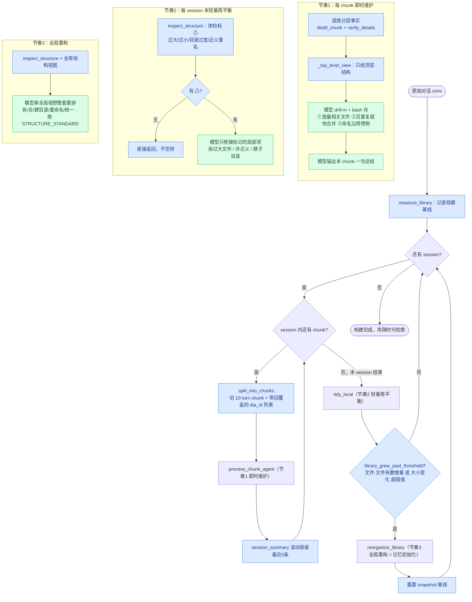
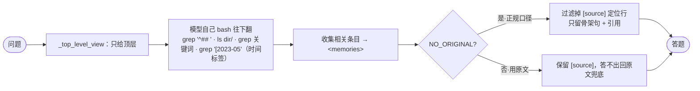

# Agent 自组织记忆管理 — 详细设计文档

> 版本：spec-3（重构结构），2026-07-06。
> 目的：实现蓝图——照此写代码，取代 v6 的 `store_facts_code`（硬编码 `people/{person}.md`）。
> 落地代码：`src/nativemem.py` + `src/adapters/run_nativemem.py`。
> 实现计划：`docs/superpowers/plans/2026-07-07-agent-self-organized-memory.md`。

文档分四部分：**总览**（§1–3 建立全貌）、**核心机制**（§4–6 每个概念唯一定义处）、**实现**（§7–11 每块怎么落地）、**参考**（§12–14 配置/清单/实验）。

---

# 第一部分 · 总览

## 1. 设计目标与核心红线

一份原始对话 → 按 10-turn 切 chunk → 每个 chunk 交给 agent，agent **看着当前记忆的顶层结构、自己用 bash 决定放哪**，把分层提炼的事实存进去，并输出一句总结带给下一个 chunk。周期性地，模型看全局做整理。检索时同一套"看顶层→自己往下翻"。

**目标不是刷 benchmark，是一个能真正持续用起来的记忆库**：一直增长、随时可能检索、没有"建完了"的状态。所以结构必须在任何时刻都可检索，不靠"最后整理一次"兜底。

**核心红线**：代码给顶层视图、给 bash 工具、测量报告失衡、保内容完整性；**代码不写死任何记忆内部路径、不决定按什么分、不接管"放哪"**。阈值只用来标 ⚠ 提示模型，不强制动作。结构由模型自组织，代码只有一个固定入口（记忆根目录），往下全是模型的选择。

## 2. 总流程图

蓝 = 代码做（确定性）；绿 = 模型做（语义）。三个节奏（定义见 §6）在图上分别是：节奏1 每 chunk、节奏2 每 session 末、节奏3 增长触发。



**检索**（构建完成后，与写入同一套；§10）：



## 3. 逐步运行模拟（LoCoMo sample0 真实数据）

拿 sample0 走一遍，看记忆库怎么从空长起来、三节奏在哪触发。真实规模：**Caroline & Melanie，19 个 session，419 个 turn，按 10-turn 切共 49 个 chunk**。阈值用默认值（过大 >150 条、过宽 >20 项、节奏3 增长 ×2.0 或 文件+目录增量 ≥8；定义见 §6）。

**起点·空库**：`memory/` 空，`snapshot = {files:0, dirs:0, bytes:0, entries:0}`。

**session 1（18 turn → 2 chunk）**
- chunk 1（D1:1–D1:10）提炼出几条事实（Caroline 去了 LGBTQ 支持小组、被跨性别故事打动…）。agent 看顶层视图 = `(empty memory)`，无可复用文件 → 新建 `Caroline.md`，按话题起 `## Support Group`：
  ```
  # Caroline.md
  ## Support Group
  [2023-05-08] Caroline went to an LGBTQ support group the day before and found it powerful.
    > "I went to a LGBTQ support group yesterday and it was so powerful."
    [source](D1:3)
  [2023-05-08] The transgender stories at the group inspired Caroline.
    > "The transgender stories were so inspiring!"
    [source](D1:5)
  ```
- chunk 2（D1:11–D1:18）agent 看顶层视图 = `Caroline.md`，即时维护规则①"放最相关的已有文件" → 追加进 `Caroline.md`，涉及 Melanie 的事实新建 `Melanie.md`。
- session 1 末 → 节奏2：体检两文件各十几条，无 ⚠ → 直接返回不花 API。节奏3 判定：`{files:2,...}` vs 基线 `{0,...}`，增量 2 < 8、`old.bytes=0` 不触发比值 → 不触发。

**session 2–7（累积 ~14 chunk）**：每 chunk 走"顶层视图 → 放最相关文件"。只有两个主体，绝大多数事实就近堆进这两个文件（**§5 实测的"模型爱堆"——小规模是优点，稠密好查**）。偶尔冒新主题新建 `Adoption.md`/`Pottery.md`。
- 每 session 末节奏2：文件没到 150 条多半无 ⚠ 空过；出现近义重名 → 标 `dup` ⚠ → 局部合并。
- 节奏3：新建几个主题文件后，某 session 末 `files+dirs` 增量 ≥8，**首次触发全局重构**，模型归拢散落话题、统一命名，重置基线。

**session 8（39 turn → 4 chunk，最大）**：一次涌入 4 chunk、几十条，`Caroline.md` 可能逼近上百条。
- session 8 末节奏2：测到 `Caroline.md > 150 条` → 标 `big` ⚠ → 先 `consolidate_topics` 并文件内近义小标题；仍过大 → 模型按 `##` 标题拆成 `Caroline/Support-Group.md`、`Caroline/Adoption.md`…（是否留摘要页看 `SUMMARY_PAGE`，§14）。
- 拆分把文件数从 1 变多 → 可能把 `Δ文件数` 推过节奏3 阈值 → 同一 session 末**节奏2 拆完、节奏3 再全局收一遍**（§6 边界约定"局部修不够升级全局"）。

**session 9–19 同理**：重复"就近堆(节奏1) → 每 session 体检(节奏2 多数空过) → 攒够增长才全局重排(节奏3)"。19 session 走完，节奏3 约触发 2–4 次（增长驱动，不是每 session）。最终库大致：
```
memory/                           （下面是 SUMMARY_PAGE=on 的形态；off 则无同名 .md）
  Caroline/            （话题多，已拆子目录）
    Support-Group.md
    Adoption.md
    ...
  Caroline.md          （摘要页 + 链接；仅 SUMMARY_PAGE=on）
  Melanie/  ...
  Melanie.md           （摘要页 + 链接；仅 SUMMARY_PAGE=on）
```

> 拆子目录后**建不建同名摘要页**是实验变量（§14 `SUMMARY_PAGE`）：`on`=维基 summary-style（主文件留摘要+链接，检索少翻一层，但有同步成本、弱模型可能不同步）；`off`=只留子目录，子文件名即话题，靠 `ls`+`grep -r` 检索（零同步成本）。哪个好用实测定。

**构建完 → 检索** "When did Caroline go to the LGBTQ support group?"（evidence = `D1:3`）：
1. agent 拿顶层视图 = 上面那棵树。
2. bash 往下翻：`grep -ri 'support group' .` → 命中 `Caroline/Support-Group.md`，`cat`。
3. 收集 `[2023-05-08] Caroline went to an LGBTQ support group... [source](D1:3)` → `<memories>`。
4. 不用原文口径：过滤 `[source](D1:3)` 行，只看骨架句"…the day before **2023-05-08**"够答对时间。用原文口径：保留，答不出顺 dia_id 回 json 查 D1:3 兜底。
5. 命中 dia_id（`D1:3`）与 QA evidence（`D1:3`）一致 → 可算 evidence 召回（免费分析维度）。

**模拟印证三件事**：① 小规模就近堆是对的（session 1–7 稠密单文件）；② 拆分量到阈值才做（session 8 才首拆）；③ 节奏3 增长驱动、只触发几次不空转。

---

# 第二部分 · 核心机制

## 4. 数据格式：三行块 + dia_id 锚

### 4.1 一条记忆条目

存进任何 `.md` 文件的一条记忆，永远是这三行块：

```
[2023-05-08] Caroline went to an LGBTQ support group the day before 2023-05-08 and found it powerful.
  > "I went to a LGBTQ support group yesterday and it was so powerful."
  [source](D1:3)
```

- 第 1 行：`[YYYY-MM-DD]` 时间标签 + **骨架句**（提炼、代词消解、时间锚定、专名原词嵌入）。`normalize_date()` 保证标签格式统一，是时间检索的抓手（§11）。
- 第 2 行：`> "..."` **原文引用**（verbatim，是我们提炼出的记忆内容，两口径都保留）。
- 第 3 行：`[source](dia_id)` **来源锚**，来自多句就列多个 `[source](D1:3, D1:5)`。"不用原文"口径过滤掉的就是这一行（§10）。

### 4.2 来源为什么用 dia_id（不用行号、不造文件）

**`dia_id` 是 LoCoMo 每个 turn 自带的稳定唯一 id（`D1:3` = 第1个 session 第3句）。** 查了主流做法后的定论：

- **行号零系统采用**，且脆（json 一重格式化就漂）。放弃。
- **主流都用"每条内容一个稳定 id、引用靠 id 不靠位置"**：Claude Code 自己的 session 历史用 `uuid`+`parentUuid`；Graphiti 用 episode uuid；MemoryOS 用 page_id；LoCoMo 官方 RAG baseline 和 TiMem 直接用 `dia_id`。
- **`dia_id` 就是 LoCoMo 版的 uuid**：数据集固有、无需造文件/算行号、天然稳定；且 QA 的 `evidence` 也是 dia_id 列表，用它做锚能直接和 evidence 对齐算召回。

**回溯原文**：拿 dia_id 去原始 json 查那条 turn（dia_id 是唯一键），精确、零额外文件。只在"用原文"加分口径需要（§10）。记忆目录里**不存原始对话**，原文留在数据集原位置。

## 5. 结构：模型自组织 + 好结构标准

### 5.1 结构由模型自组织，代码不预设

记忆根目录下长什么样**完全由模型建**：可能 `Caroline.md`、可能 `people/`、可能按主题分——都是模型的选择。代码只知道根目录这一个固定入口，往下不预设任何路径。

### 5.2 两个实测前提（决定了为什么要三节奏）

- **模型倾向往一起堆**：v1（最自由）实测把 2 个人 555 条全塞进 2 个文件，不主动拆。**小规模是优点（稠密、少跳转），大规模是灾难（巨文件、检索捞不准）。**
- **增量视野不足以做好结构**：写入时模型只看到当前 chunk + 顶层视图（全库摊开会爆上下文），做不了全局结构决策，就近堆是理性的。

**结论**：结构质量不该指望增量写入一次到位。写入越简单越好（反正会被再平衡），有全局视野的整理才是决定库长什么样的核心——这就是三节奏（§6）的由来。

### 5.3 好结构标准 `STRUCTURE_STANDARD`（写入软引导 + 整理目标共用一把尺）

同一份标准，写入时是软引导（尽量遵守），整理时是重排目标：

- **文件别太大**：单文件条目过多 → grep 噪声大、检索捞不准。
- **文件别太碎**：一堆只有几条的小文件 → 检索要跳很多次、顶层视图爆。
- **目录别太宽**：一个文件夹平铺几十个文件 → `ls` 一屏看不完、定位难。
- **同主题别分散**：一个话题散在多个文件 → 检索会漏。
- **命名统一**：同一实体/主题别出现近义重名（`LGBTQ_Support_Group.md` vs `lgbtq-support-group.md`）。
- **默认浅、按需深**：小规模一主体一文件（v1 实测的自然形态）；大到超标才拆子目录。拆后是否留同名摘要页 + 链接是实验变量（§14 `SUMMARY_PAGE`），不预设。

## 6. 三节奏（唯一定义处）

结构维护分三个节奏，按代价和视野分层——这是真实记忆系统的通用机制（Mem0/A-Mem 写入即时维护、维基低频大重构、数据库索引增量维护+后台 rebalance），非 benchmark 特判。**本节是三节奏的唯一定义，其他章节只引用不重述。**

### 6.1 三节奏总表

| | **节奏1 即时维护** | **节奏2 轻量再平衡** | **节奏3 全局重构** |
|---|---|---|---|
| **频率/时机** | 每 chunk | 每个 session 处理完 | 每 session 末（节奏2 之后）检查一次 |
| **视野** | 局部（顶层视图 + 目标文件） | 按需（体检标 ⚠ 的文件） | 全局（全库结构 + 报告） |
| **代价** | 最低 | 中（多数 session 空转） | 高 |
| **触发条件** | 无条件——写入本身就是节奏1 | 无条件调 `tidy_local`，**内部**靠 ⚠ 决定动不动 | `library_grew_past_threshold` 为真 |
| **谁判定** | 主循环（每 chunk 必走） | 主循环（每 session 必调） | 代码比较规模快照 |
| **判定的具体量** | — | `inspect_structure` 是否有 ⚠：单文件 `>BIG_FILE(150)` / `<SMALL_FILE(8)` 条、目录 `>WIDE_DIR(20)` 项、近义重名 | 自上次重构起：`Δ(文件+文件夹数) ≥ REORG_FILE_DELTA(8)` **或** `字节比值 ≥ REORG_GROWTH(2.0)`，任一满足 |
| **触发后动作** | 提炼 + drill-in + bash 存（三规则，§7.4） | 只对 ⚠ 项局部修（§9.2）；无 ⚠ 直接返回 | 模型拿全局视野整套重排（§9.3），完后重置 snapshot 基线 |
| **可关闭** | 不可关（写入必需） | `NATIVEMEM_REBALANCE=off` | `NATIVEMEM_REORG_GROWTH=off` |
| **关掉的效果** | — | 失衡全攒到节奏3 | 永不全局重排，只靠节奏2 局部修 |

代价随频率反比：高频的最便宜（局部），低频的才贵（全局）。任何时刻来检索结构都可用：节奏1 保底不烂、节奏2 周期修、节奏3 定期重排。

### 6.2 边界约定

- **节奏2 廉价**：`tidy_local` 每 session 必被调，但先跑 `inspect_structure`，没 ⚠ 立即返回不花 API。绝大多数 session 空过。
- **节奏3 双指标取或**：文件/文件夹数增量（结构变复杂）和字节增长（内容变多）任一超标就触发，覆盖"文件没增多但单文件疯涨"和"疯狂建小文件但总量没涨"两种失衡。
- **节奏3 触发后必重置 snapshot**：下轮增长从新基线算，避免刚重构完又立刻满足阈值反复触发。
- **同一 session 两节奏可都触发**：先局部修（节奏2），再判增长（节奏3）。节奏2 的拆分本身改变文件数，可能正好把 `Δ文件数` 推过节奏3 阈值——预期行为（局部修不够就升级全局）。
- **benchmark 无特判**：没有"conv 建完强制整理一次"。conv 结束时增长达标则节奏3 自然触发，否则节奏2 已维持到可检索。机制对"持续增长的真实库"和"跑批 benchmark"是同一套。
- **弱模型兜底**：qwen3.6-flash 等可能建乱，防护全靠这三节奏 + 顶层视图天然抑制重复新建，**不设代码深度/大小硬护栏**（那就是代码控制结构，越红线）。真乱到不可用再用实测数据说话。

---

# 第三部分 · 实现

## 7. 写入：`process_chunk_agent()`（替代 v6 的 distill→store_facts_code）

### 7.1 函数签名

```python
def process_chunk_agent(chunk_text, chunk_date, memory_dir, dia_ids,
                        running_summary="", mode="oneshot") -> str:
    """处理一个 chunk：提取+自组织存+总结。返回本 chunk 的短总结
    （给下一个 chunk 当 running_summary）。mode: 'oneshot' | 'threecall'。
    dia_ids: 本 chunk 覆盖的 LoCoMo turn id 列表（如 ['D1:1',...,'D1:10']），
    提炼每条记忆时选取相关 dia_id 写进 [source] 锚。"""
```

### 7.2 提取（复用现有分层提炼）

复用现有 `_LAYERED_DISTILL_PROMPT` 和 `distill_chunk()` 的产出：每条事实 = `{person, topic, skeleton, keep_verbatim, verbatim}`，`skeleton` 已代词消解/时间锚定/专名原词。提炼后跑 `verify_details()` **代码硬校验**：`keep_verbatim` 里真专名/数字骨架漏了的，用 `_extract_proper_nouns` 交叉核对补回。

### 7.3 顶层视图 `_top_level_view(memory_dir)`

给 agent 的结构上下文——**只列根目录直接子项，不展开文件内部**：

```
Caroline.md
Melanie.md
projects/  (3 items)
```

跳过 `raw/` 和隐藏文件；目录标注内含项数。这是模型 drill-in 的起点，视图恒小（一个 `ls`），记忆再大也不爆上下文。

### 7.4 即时维护三规则（节奏1 的 prompt 内容）

写入不是"随便堆"也不是"追求完美结构"，而是**局部视野内力所能及的维护**。prompt 时刻提醒这三条（都局部可判、不需全局视野）：

1. **放最相关的已有文件**：先 drill-in 看顶层视图和相关文件，把新事实放进语义最近的已有文件/小标题下，别新开文件堆一起。确实没对应主体才新建。
2. **见重复就地合并/更新**：同一事实的新版本（时间更新、细节补充、状态改变）就地改已有条目或紧挨着补，别无脑追加造重复。
3. **命名沿用惯例**：新文件/小标题命名看已有的怎么起就怎么来，别造近义重名。

做不到完美没关系——节奏2/3 会兜底。

### 7.5 两种执行模式（`mode` 参数，与模型强弱解耦）

**oneshot**：一次 agent 会话（多轮 bash）做完。给它 `running_summary` + `_top_level_view` + chunk 原文 + obs_date + `dia_ids` + `STRUCTURE_STANDARD`；agent 提炼 → bash 存（三规则 §7.4）→ 输出 `<summary>...</summary>`；代码正则抽出。

**threecall**：三次独立调用。①提炼（`distill_chunk`，无工具）②存储（给 `_top_level_view` + facts + `dia_ids` + 三规则，agent bash 存）③总结（返回一句话）。

两模式产出的记忆格式（§4.1）完全一致。开关 `NATIVEMEM_STORE_MODE=oneshot|threecall`。

### 7.6 工具与红线

- agent 用现有 `bash` 工具（`TOOLS`）；记忆目录里本就没原文，无需屏蔽 raw。
- `STRUCTURE_STANDARD`（§5.3）写入时作软引导（非强制）。
- 代码**不**校验/纠正 agent 建的结构（不硬控），乱了交给整理（§9）。

## 8. 构建主循环：`build_memory()` v7 分支

`split_into_chunks(session, 10)`：按 10-turn 切 chunk，每个 chunk 同时带回覆盖的 **dia_id 列表**（读每个 turn 的 `dia_id` 字段，不算行号）。

三节奏（§6）都挂在主循环上：

```
snapshot = measure_library(memory_dir)           # 节奏3 增长基线
for si, session in enumerate(sessions):
    session_summary = ""                          # 每个 session 清空
    for chunk, dia_ids in split_into_chunks(session, 10):
        # 节奏1：即时维护（三规则在 prompt 里，§7.4）
        s = process_chunk_agent(chunk, date, memory_dir, dia_ids,
                                running_summary=session_summary, mode=STORE_MODE)
        session_summary = tail(session_summary + f"\n- {s}", n=5)   # 滚动保留最近5条
    # 节奏2：每 session 末轻量再平衡（§9.2）
    tidy_local(memory_dir)
    # 节奏3：库规模增长超阈值 → 全局重构（§9.3）
    if library_grew_past_threshold(snapshot, measure_library(memory_dir)):
        reorganize_library(memory_dir)
        snapshot = measure_library(memory_dir)     # 重置基线
```

- **session 间清空 `session_summary`**：跨 session 连贯性靠存进去的记忆本身，不靠总结硬拼。总结不落盘，只在内存变量传递。
- **`measure_library`**：返回 `{files, dirs, bytes, entries}`，是节奏3 的增长基线。
- **`library_grew_past_threshold`**：判定量见 §6.1 表。
- **无"最后整理一遍"特判**：结构随时可用靠三节奏保证。

## 9. 整理：`tidy_local`（节奏2）+ `reorganize_library`（节奏3）

分工红线：**代码只测量报告失衡（确定性），模型决定怎么修（语义）**。代码不决定拆成几个、怎么命名、建哪个目录——只用阈值标 ⚠ 交给模型。触发时机/条件见 §6.1。

### 9.1 结构体检 `inspect_structure(memory_dir)`（纯测量，两节奏共用）

扫全库，输出纯数据报告，把每个失衡维度（§5.3）用阈值标 ⚠：

```
memory/ 结构报告:
- Caroline.md: 277 条, 8 个 ## 标题     ⚠ 过大 (>150)
- adoption.md: 4 条                      ⚠ 过小 (<8), 疑与 Caroline 重叠
- groups/: 23 个直接子项                 ⚠ 目录过宽 (>20)
- 近义文件名: [lgbtq-support-group.md, LGBTQ_Support_Group.md]  ⚠ 疑重复
全库: 12 文件 / 3 目录 / 640 条 / 最深 2 层
```

测什么（都确定性）：每文件 `[YYYY-MM-DD]` 条目数、`## ` 标题数；每目录直接子项数；跨文件近义文件名（复用扩展 `_find_merge_candidates`，从"文件内标题"扩到"跨文件文件名"）；全库总量/深度。阈值只标 ⚠ 提示，不强制动作。返回 `{report, warnings}`。

### 9.2 节奏2：`tidy_local(memory_dir)`（局部、便宜）

只修**明确超阈值的局部问题**，不做全局重排：

1. `inspect_structure` 找 ⚠。**没有 ⚠ 直接返回**（多数 session 不动，省钱）。
2. 对每个 ⚠ 项局部修：
   - **单文件过大** → `consolidate_topics`（已实现：文件内并近义标题、去重）先压；仍过大 → 模型按 `##` 标题拆子文件（是否留摘要页看 `SUMMARY_PAGE`，§14）。
   - **近义重名** → 模型合并两文件到一处，留链接。
   - **过小/孤儿文件** → 交给节奏3（局部视野判不了该并到哪，先不动）。
3. 只碰被标记的那几个文件，不重排全库。

### 9.3 节奏3：`reorganize_library(memory_dir)`（全局、贵）

模型拿**全局视野**做一整轮再平衡——这就是"记忆初始化"（§5.2：结构质量的核心在这，不在增量写入）：

1. 代码给模型：`inspect_structure` 报告 + 全库结构视图（所有文件 + 各自 `##` 标题）。
2. 模型按 `STRUCTURE_STANDARD`（§5.3）统筹整套重构，用 bash 执行：拆过大文件、合分散主题、过宽目录按子主题分组、并孤儿文件、统一命名、建/拆子目录（是否留摘要页 + 链接看 `SUMMARY_PAGE`，§14）。
3. **失衡维度的矛盾由模型一次性权衡**（拆了会不会又太碎、合了会不会又太大），避免代码逐规则互相震荡。

`_REBALANCE_PROMPT` 要点：给报告 + 结构视图 + `STRUCTURE_STANDARD` 目标 + "你有全局视野，把库重排成任何时刻都好检索的样子；拆合建删随你，红线是别丢内容、别改每条的 `[source](dia_id)` 锚"。

## 10. 检索 + 两种口径

### 10.1 检索：`collect_memories()`（与写入同一套）

写入是"看顶层→自己往下翻→放"，检索就是"看顶层→自己往下翻→取"，同一套动作（RAM 自洽）：

1. 给 agent `_top_level_view` + 问题。
2. agent 用 bash 往下翻：`grep '^## ' <file>` 看某文件主题、`ls <dir>/` 进子目录、`grep '<关键词>' -r .` 按内容找、`grep '\[2023-05' -r .` 按时间标签找（§11）。
3. 收集相关条目，输出到 `<memories></memories>`。
4. 记忆目录里没原文，grep/ls 天然只在记忆里翻，够不到原始对话。

现有 grep 模式（模型硬 grep 全部）和 nav 模式（代码替模型选主题）都不是这个形态；本设计统一成"模型看顶层自己翻"。

### 10.2 两口径（检索时给不给 `[source]` 锚行）

记忆里每条都是三行块（骨架句 + 引用 + `[source](dia_id)`）。原文不复制，两口径差别只在检索时：

- **不用原文（正规口径，论文主结果）**：过滤 `[source](...)` 行，答题只看骨架句 + 记忆里那句引用，够不到原始文件。跟 Mem0/LightMem 公平比。开关 `NATIVEMEM_NO_ORIGINAL=1`。
- **用原文（我们独有加分项）**：保留 `[source]` 行，答不出时顺 dia_id 回原始 json 查那条 turn 兜底（唯一键，精确）。

## 11. 时间维度：标签 + 命令筛，不建时间结构

同一份对话可按主题或时间组织，但**不存多套内容**（一致性/去重/更新噩梦，A-Mem/Zep/生成式 agent 都避免，都用"一份内容+多维索引"）。

- 内容**只有一套**：模型按主题自组织的那套。
- 时间**不做成结构**：嵌在每条记忆的 `[YYYY-MM-DD]` 标签里（`normalize_date` 保证格式统一）。
- 时间检索 = **模型自己写命令按标签筛**：某月 `grep '\[2023-05' -r .`、某天 `grep '\[2023-05-08\]' -r .`，任意粒度。和主题检索同一套"模型用 bash 探索"逻辑。
- 分工：主题=语义判断（模型，可能不严格）；时间=确定性（代码保证标签格式统一、命令精确筛）。

---

# 第四部分 · 参考

## 12. 配置开关汇总

| 环境变量 | 取值 | 作用 |
|---|---|---|
| `NATIVEMEM_PROMPT` | `v7` | 启用本设计（agent 自组织）；`v4/v5/v6` 保留做对比 |
| `NATIVEMEM_STORE_MODE` | `oneshot`/`threecall` | 写入一次做完 vs 分三次（§7.5）|
| `NATIVEMEM_NO_ORIGINAL` | `1`/未设 | 检索过滤 `[source]` 行（正规口径）vs 保留（§10.2）|
| `NATIVEMEM_REBALANCE` | `on`/`off` | 节奏2：每 session 末轻量再平衡 / 关（§9.2，消融）|
| `NATIVEMEM_REORG_GROWTH` | `2.0`/`off` | 节奏3：库字节较上次重构增长超此比例触发 / 关（§9.3）|
| `NATIVEMEM_REORG_FILE_DELTA` | `8` | 节奏3：文件+文件夹数增量超此值也触发（与增长比取或，§6.1）|
| `NATIVEMEM_BIG_FILE` | `150` | 单文件条目数 ⚠ 过大阈值（§9.1）|
| `NATIVEMEM_SMALL_FILE` | `8` | 单文件条目数 ⚠ 过小阈值（§9.1）|
| `NATIVEMEM_WIDE_DIR` | `20` | 目录直接子项数 ⚠ 过宽阈值（§9.1）|
| `NATIVEMEM_SUMMARY_PAGE` | `on`/`off` | 拆子目录后是否建同名摘要页 + 链接（实验变量，§14）|
| `BUILDER_MODEL` | `qwen3.6-flash` 等 | 构建/答题模型（阿里云端点）|

## 13. 复用 vs 新写（实现清单）

**复用现有**：`distill_chunk` / `_LAYERED_DISTILL_PROMPT`（分层提炼）、`verify_details` / `_extract_proper_nouns`（专名硬校验）、`normalize_date`（时间标签）、`consolidate_topics` / `_find_merge_candidates` / `_MERGE_PROMPT`（节奏2 文件内并标题、去重；`_find_merge_candidates` 扩展成跨文件找近义名）、`log_usage`、`client`/`TOOLS`/`execute_tool`。

**新写**：
- `split_into_chunks`（切 chunk + 带回 dia_id 列表，§8）。
- `_top_level_view`（§7.3）、`process_chunk_agent`（写入主体 + oneshot/threecall + 三规则，§7）、`_AGENT_STORE_PROMPT`。
- `STRUCTURE_STANDARD`（好结构定义，§5.3）。
- `inspect_structure`（结构体检，§9.1）、`measure_library` + `library_grew_past_threshold`（节奏3 增长触发，§8）。
- `tidy_local`（节奏2，§9.2）、`reorganize_library` + `_REBALANCE_PROMPT`（节奏3，§9.3）。

**改动**：`build_memory`（v7 分支，§8）、`collect_memories`（v7 分支，§10.1）。

**废弃/去掉**：`save_to_raw_archive` 和 `execute_tool` 的 `hide_raw`（记忆里没原文）；`store_facts_code`（硬编码路径，v7 不走，保留给旧版本）。

## 14. 实验维度

- **执行模式**：oneshot vs threecall（§7.5）。
- **加工强度**：分层 vs 纯删废话 vs 纯总结。
- **模型能力**：qwen3.6-flash（弱）vs 强模型，各自最优模式/强度。
- **口径**：不用原文 vs 用原文（§10.2）。
- **整理节奏**（§6）：全三节奏 vs 只即时维护+全局重构 vs 全不整理——验证结构维护对最终检索的贡献，也验证"持续可用"不靠 benchmark 特判的最后一次整理。
- **摘要页**（`SUMMARY_PAGE` on/off）：拆子目录后建同名摘要页 vs 只留子目录。验证摘要页对检索跳数/准确率的净影响，以及弱模型（qwen3.6-flash）维护摘要页的同步质量——摘要页省一层检索，但有同步成本、可能过时误导。哪个净收益高实测定。
